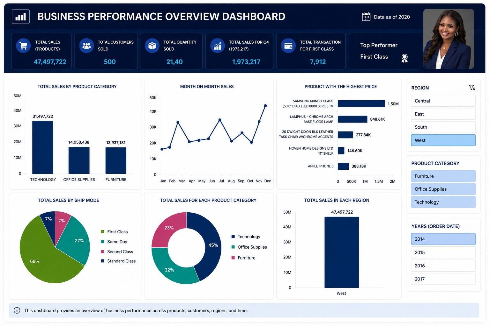

# Excel Business Performance Dashboard
   
## Project Overview
Interactive Excel dashboard analyzing 3 years of sales data to identify trends in sales performance, product categories, and customer behavior. Built entirely in Excel using Pivot Tables, Slicers, and Charts.

## Key Insights
- Identified top-performing product categories and regions
- Analyzed sales trends over 3 years using slicers for dynamic filtering
- Created KPI cards for quick performance overview
- Designed a clean, recruiter-friendly dashboard layout

## Tools Used
- **Excel**: Pivot Tables, Slicers, Conditional Formatting
   - **Visualization**: Bar charts, Line charts, Pie charts, Donut charts

## Files
- `Orderstd.xlsx` – Raw dataset with 3 years of sales data
- `business.jpeg` – Screenshot of the interactive dashboard

## How to View
1. Download `Orderstd.xlsx`
2. Open in Excel 2016 or newer
3. Use the slicers to filter by region, product category, and year
